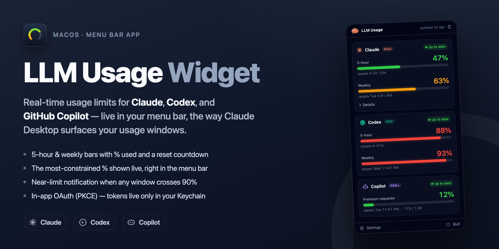
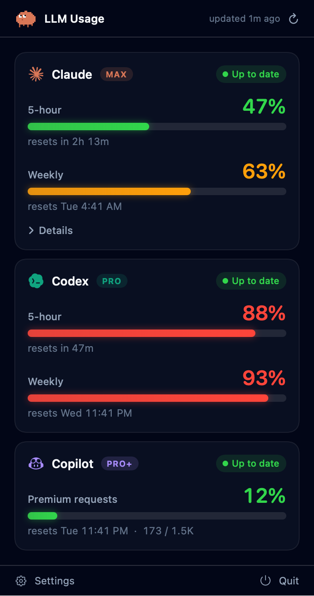

<div align="center">



<h1>LLM Usage Widget</h1>

**Real-time usage limits for your main LLM tools — [Claude](https://claude.ai), [Codex](https://chatgpt.com), and [GitHub Copilot](https://github.com/features/copilot) — live in your macOS menu bar.**

It surfaces your usage windows the way Claude Desktop does: a glanceable `%` in the menu bar, and a tap-away popover with bars, reset countdowns, and near-limit alerts.

[](https://github.com/flukelaster/LLM-Usage-Widget/releases/latest)


</div>

> [!NOTE]
> **First launch** is a one-time Gatekeeper step (the build is ad-hoc signed): right-click the app → **Open**. See [Distribution](#-distribution).

---

## ✨ What you get

<table>
<tr><td width="60%" valign="top">

Click the menu-bar gauge to see, per provider:

- 📊 A big **5-hour** and **weekly** usage bar with **% used** and a **reset countdown**
- 🚦 Threshold colors — 🟢 green &lt; 60% · 🟡 amber 60–85% · 🔴 red &gt; 85%
- 🏷️ **Plan badge** (Max / Pro / Plus …) and an *up to date / rate-limited / stale* status
- 📍 A live **% in the menu bar** itself — the most-constrained window across providers
- 🔔 A **notification** when any window crosses **90%** (once per window per reset cycle)
- 🔐 **In-app OAuth** (PKCE) — tokens live only in your macOS **Keychain**

</td><td width="40%" valign="top" align="center">



</td></tr>
</table>

## 🚀 Quick start

**Requirements:** macOS 14 (Sonoma)+ · Swift 6 toolchain (Command Line Tools are enough — full Xcode not required).

```bash
./Scripts/run.sh                   # build (debug) → package UsageWidget.app → launch
./Scripts/package_app.sh release   # just build the release .app bundle
```

The app is menu-bar-only (`LSUIElement`, no Dock icon). Look for the gauge in the top-right of the menu bar.

## 🔑 Signing in

Open the popover and click **Sign in** on a provider card:

| Provider | Flow |
|---|---|
| **Codex** | Opens your browser to OpenAI; a tiny local listener on `127.0.0.1:1455` captures the redirect automatically — nothing to paste. |
| **Claude** | Opens your browser to Anthropic, which shows a code (`abc123#xyz`). Paste it back into the card. (Anthropic rejects arbitrary loopback redirects, so this paste step is required.) |
| **Copilot** | GitHub's device flow: the card shows a short code; enter it at `github.com/login/device` (opened for you) and the app finishes automatically. |

Manage providers (enable/disable, sign out), poll interval, menu-bar display, **near-limit notifications**, and **Launch at login** from **Settings** (footer of the popover).

## 🛰️ How it gets the data

| Provider | Endpoint | Notes |
|---|---|---|
| Claude | `GET api.anthropic.com/api/oauth/usage` | The endpoint Claude Code's `/usage` uses. Requires `anthropic-beta` + `claude-code/<ver>` User-Agent. Rate-limits hard → polled ≥ 5 min with exponential backoff. |
| Codex | `GET chatgpt.com/backend-api/wham/usage` | Returns primary (5h) + secondary (weekly) windows. |
| Copilot | `GET api.github.com/copilot_internal/user` | Monthly premium-request quota (`quota_snapshots`) + reset date. |

The last-good snapshot is cached to `~/Library/Application Support/com.flukelaster.usagewidget/`, so the popover shows data instantly and **never blanks out** on a failed refresh.

> [!WARNING]
> These endpoints and the first-party OAuth client IDs are **undocumented / unofficial** and may change without notice. This app reads only **your own** subscription usage and never automates inference. Use is a gray area under each vendor's terms; it degrades gracefully if an endpoint changes (cached data + a clear error, never a crash).

<sub>Gemini and Cursor were evaluated but deferred: Gemini's individual CLI usage API is mid-migration to Antigravity, and Cursor requires reading the editor's local SQLite with full-disk access and has no per-user official API.</sub>

## 🧪 Verification

```bash
swift build                                   # compile
.build/debug/UsageWidget --check              # logic self-checks (parsing, PKCE, backoff, …)
.build/debug/UsageWidget --snapshot out.png   # render the popover UI to a PNG (DEBUG)
```

> The Command-Line-Tools toolchain ships neither XCTest nor swift-testing, so the test suite is an in-process self-check runnable via `--check`. Add an XCTest/Testing target if you install Xcode.

## 🗂️ Project layout

```
Sources/UsageWidget/
  App/         @main entry, AppDelegate, composition root, snapshot/self-check runners
  MenuBar/     menu-bar label + popover root
  Domain/      UsageProvider protocol + unified models (LimitWindow, ProviderUsage, …)
  Providers/   Claude/, Codex/, Copilot/ — OAuth clients, usage fetchers, orchestration
  Auth/        PKCE, Keychain, TokenStore, loopback OAuth server
  Engine/      UsageStore (@Observable), RefreshScheduler, BackoffPolicy, SnapshotCache
  Settings/    SettingsModel/View, LaunchAtLogin (SMAppService)
  Views/       design tokens, provider card, limit-window bar, states, Claude mascot
  Diagnostics/ SelfChecks
```

Regenerate the app icon after design tweaks with `./Scripts/make_icon.sh` (renders the SwiftUI icon → `Resources/AppIcon.icns`). Regenerate this README's cover with `node Scripts/make_cover.mjs`.

## 📦 Distribution

Build a distributable disk image:

```bash
./Scripts/release.sh      # → dist/LLM-Usage-Widget.dmg (drag-to-Applications installer)
```

The build is **arm64 (Apple Silicon)** and **ad-hoc signed** — there's no Apple Developer ID on this machine, and a universal arm64+x86_64 build would need full Xcode (`xcbuild`). It runs fine when shared, but the **first launch on another Mac** needs a one-time Gatekeeper bypass:

- Right-click the app → **Open** (then confirm), or
- `xattr -dr com.apple.quarantine "/Applications/UsageWidget.app"`

For a **clean, no-warning build** (recommended if you distribute widely), get an Apple Developer ID ($99/yr) and notarize — `Scripts/notarize.sh` does the Developer-ID sign + hardened runtime + `notarytool` submit + staple:

```bash
DEV_ID="Developer ID Application: Your Name (TEAMID)" \
APPLE_ID="you@example.com" TEAM_ID="TEAMID" APP_PW="app-specific-password" \
./Scripts/notarize.sh        # then ./Scripts/release.sh to wrap it in a .dmg
```
