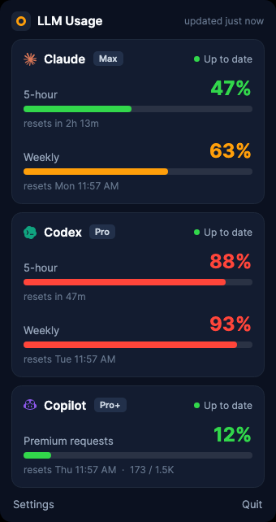
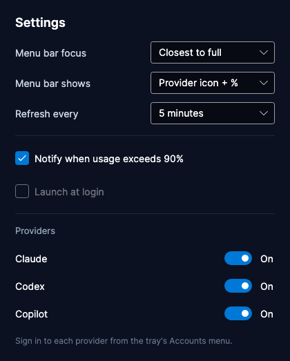

# LLM Usage Widget — Windows

A Windows port of the macOS menu-bar app, built with **.NET 10 + [Avalonia](https://avaloniaui.net/)**.
It lives in the **system tray**: click the gauge for a popover with per-provider usage bars, reset
countdowns, plan badges, and near-limit status — the same design as the macOS app.

<div align="center">
  
</div>

## Layout

```
windows/
  src/Core/    Platform-agnostic core (no UI): domain models, provider parsers,
               OAuth clients, HTTP fetchers, DPAPI token store, and the polling engine.
  src/App/     Avalonia tray app: theming, view-models, the popover, and sign-in windows.
  tests/       xunit suite mirroring the macOS app's self-checks (parsing, PKCE, JWT, …).
```

The `Core` project is shared, UI-free, and fully unit-tested. `App` is the Avalonia front end.

## Requirements

- [.NET SDK 10](https://dotnet.microsoft.com/download) (LTS-class). On macOS: `brew install dotnet`.
- Building the **app** works on any OS (Avalonia is cross-platform); the produced executable targets
  Windows 10/11 x64.

## Build, test, run

```bash
cd windows
dotnet test                                   # run the core unit tests
dotnet build                                  # build the whole solution

# Render the popover UI to a PNG (headless — works on any OS, mirrors the macOS --snapshot):
dotnet src/App/bin/Debug/net10.0/LLMUsageWidget.App.dll --snapshot out.png
```

On **Windows**, run the tray app with `dotnet run --project src/App`.

## Package a Windows executable

```powershell
pwsh windows/publish.ps1        # → windows/dist/win-x64/LLMUsageWidget.App.exe (self-contained)
```

This emits a **self-contained, single-file** `.exe` (bundles the .NET runtime + Skia), so it runs on
a clean Windows machine with nothing pre-installed.

> Build on **Windows** for the full release: the project targets a Windows TFM there, enabling native
> **toast notifications** and **launch-at-login** (behind `#if WINDOWS`). The same `dotnet publish`
> cross-builds from macOS/Linux too, but that build targets plain `net10.0`, where those two features
> compile out to no-ops.

## How auth & storage map to Windows

| Concern | Implementation |
|---|---|
| Token storage | `FileTokenStore` — encrypted with **Windows DPAPI** (per-user) under `%APPDATA%\LLMUsageWidget` |
| Codex loopback OAuth | `HttpListener` on `127.0.0.1:1455` |
| Claude / Copilot sign-in | Paste-code window / device-code window |
| Open browser | `Process.Start(UseShellExecute = true)` |

The provider endpoints, OAuth client IDs, and parsing logic are identical to the macOS app.

## Settings

<div align="center">
  
</div>

Open from the tray's **Settings** item: menu-bar focus (closest-to-full or a pinned provider),
menu-bar display style, refresh interval, near-limit notifications, **launch at login** (per-user
`HKCU\…\Run`), and per-provider enable toggles. Every change persists to
`%APPDATA%\LLMUsageWidget\settings.json` and applies immediately.

## Status

Feature-complete relative to the macOS app: tested core, themed popover, OAuth + providers + polling
engine, tray + sign-in, **Settings** window, **launch-at-login**, native **toast notifications**, and
self-contained packaging. Remaining is polish (a brand-art tray icon, an installer/code-signing) and
end-to-end testing of the interactive OAuth flows on a real Windows machine.
